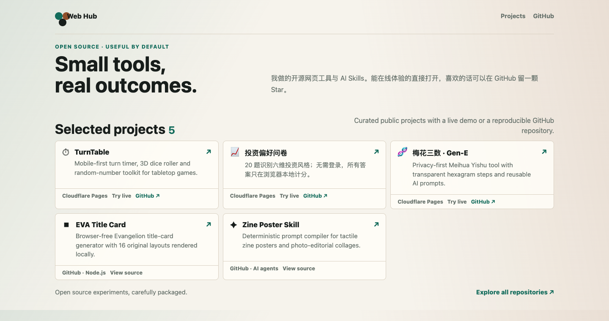

# Jason's Open Source Lab

A focused, zero-tracking portfolio for Jason's public web tools and AI agent
skills. It turns scattered projects into one curated discovery surface with direct
links to live demos and source repositories.

**[Explore the live collection →](https://jas0nhg-web-projects-hub.pages.dev/)**

**Project status:** active



## Curation rules

- Every entry has a public live demo or a reproducible GitHub repository.
- No LAN, Tailnet, localhost, admin, or port-forwarded destinations.
- Projects with unresolved privacy or client-secret risks are not promoted.
- No accounts, tracking, cookies, or visitor data storage.
- The interface follows the visitor's local time: night mode from 21:00–09:00.

## Run locally

```bash
python3 -m http.server 8792
```

Then open <http://localhost:8792>.

## Deploy to Cloudflare Pages

When importing from GitHub, use no framework or build command and publish `/`.

```bash
pnpm dlx wrangler pages dev .
pnpm dlx wrangler pages deploy . --project-name jas0nhg-web-projects-hub
```

## Data and recovery

The project is plain HTML, CSS, and JavaScript. It has no database, build output,
or irreplaceable application data; a fresh clone is the complete restore process.

## License

[MIT](LICENSE)
